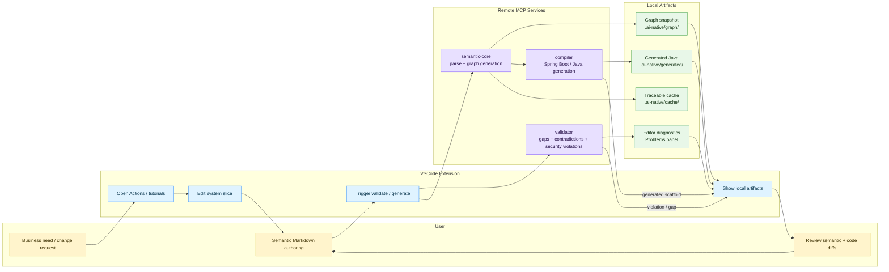

# AI Native Language

Source repository for an AI-native semantic programming workflow.

This repo is organized as a reproducible starting point for a future pilot that can:

- describe enterprise Java system slices in `Semantic Markdown`
- validate them into a canonical graph IR
- generate Java 17+ / Spring Boot output
- enforce security and dependency constraints
- remain provider-neutral across AI vendors
- support IDE-driven development through a VSCode extension and MCP tools
- support local Docker execution and remote containerized MCP servers
- include a VSCode extension scaffold with workflow views, tutorial views, and remote MCP integration

## Current Status

- specification-first
- example-driven
- no runnable pilot implementation yet
- designed to be cloned and extended by other teams

## What This Will Be Used For

This repository defines a repeatable workflow for turning a high-level system slice into a validated, traceable, Java/Spring Boot implementation.

In practical terms, it is meant for:

- describing an enterprise service in `Semantic Markdown`
- capturing interfaces, data flows, security rules, and dependencies in one source of truth
- validating the description into a canonical graph IR
- detecting gaps, contradictions, and security violations early
- generating a constrained Java 17+ / Spring Boot scaffold from the validated model
- keeping semantic changes and generated code in the same reviewable branch
- running the workflow through remote MCP services and a VSCode control plane

### Typical Workflow

1. Define the business need in a structured semantic format.
2. Validate the description for gaps, contradictions, and security issues.
3. Generate a machine-readable model of the intended system behavior.
4. Generate the Spring Boot / Java implementation scaffold from that model.
5. Review the semantic change and the code change together in VSCode.
6. Refine the semantic source until the output matches the intended business behavior.

The diagram below renders in Mermaid-capable Markdown viewers such as GitHub and VSCode preview.



The value proposition is simple: faster change, clearer review, better traceability, and less rework when requirements change.

### Example Use Cases

- internal knowledge publishing workflows with review, publish, and search
- enterprise Java modernization from legacy platform descriptions
- security-aware service generation with SSO and role-based access rules
- dependency-driven generation where existing internal modules must be used

### Reference Corpus

The repo also carries complex real-world reference material under `reference-projects/`.

- `reference-projects/event-app-be/` is a complex Spring Boot / Maven enterprise slice used to improve graph extraction and MCP heuristics.
- `reference-projects/manifest.json` controls the batch ingest list.
- New reference projects can be added later in the same format to expand the corpus and rerun `npm run reference:ingest:batch`.

Editable source-derived learning states are created in the currently opened target workspace under its own `learning-projects/` folder, not in this tooling repo.

- `learning-projects/<project>/source.semantic.md` is the editable semantic state produced from a source scan in the currently opened target workspace.
- `learning-projects/<project>/source.semantic.suggested.md` is the current source-derived suggestion.
- Import a source project from the VSCode side panel or run `npm run source:semantic -- --root <project-root> --name <project-name> --out <target-workspace>/learning-projects/<project-name>`.

This is not just documentation. The semantic source is intended to become the editable contract that drives validation, generation, and review.

## Core Documents

- [AI_Native_Semantic_Pilot_Spec.md](./AI_Native_Semantic_Pilot_Spec.md)
- [AI_Native_Semantic_Pilot_Notes.md](./AI_Native_Semantic_Pilot_Notes.md)
- [AI_Native_Semantic_Workflow.md](./AI_Native_Semantic_Workflow.md)
- [docs/REPO_STRUCTURE.md](./docs/REPO_STRUCTURE.md)
- [docs/BOOTSTRAP_GUIDE.md](./docs/BOOTSTRAP_GUIDE.md)
- [docs/MCP_SERVER_CONTRACTS.md](./docs/MCP_SERVER_CONTRACTS.md)

## Example Artifacts

- [examples/team_knowledge_publishing_service.semantic.md](./examples/team_knowledge_publishing_service.semantic.md)
- [examples/team_knowledge_publishing_service.graph.json](./examples/team_knowledge_publishing_service.graph.json)
- [reference-projects/event-app-be/event-app-be.reference.semantic.md](./reference-projects/event-app-be/event-app-be.reference.semantic.md)
- [reference-projects/event-app-be/event-app-be.analysis.md](./reference-projects/event-app-be/event-app-be.analysis.md)
- [reference-projects/event-app-be/event-app-be.reference.graph.json](./reference-projects/event-app-be/event-app-be.reference.graph.json)

## Repository Layout

```text
.
├── agents/              # bounded task schemas and policies
├── docker/              # local orchestration templates
├── docs/                # architecture and bootstrap docs
├── examples/            # semantic markdown and graph examples
├── local-runners/       # deterministic local helpers
├── mcp-servers/         # MCP server contracts and future implementations
├── vscode-extension/    # developer-facing VSCode extension scaffold
├── AI_Native_Semantic_Pilot_Notes.md
├── AI_Native_Semantic_Pilot_Spec.md
├── AI_Native_Semantic_Workflow.md
└── README.md
```

## How This Repo Is Meant To Be Used

1. Write or refine a system slice in `Semantic Markdown`.
2. Validate the slice into a canonical graph model.
3. Check gaps, contradictions, and security violations.
4. Generate Java 17+ / Spring Boot output for the target slice.
5. Review semantic and generated diffs in the same branch.
6. Refine the semantic source when needed.

## Design Principles

- Semantic source is the primary artifact.
- Graph IR is the canonical machine-readable artifact.
- Spring Boot / Java 17+ is the first target backend.
- Security is first-class.
- Dependencies and external documentation are first-class inputs.
- AI provider choice must remain interchangeable.
- Generated code must remain reviewable and traceable back to semantic source.

## Planned Components

- `mcp-servers/semantic-core`
- `mcp-servers/validator`
- `mcp-servers/compiler`
- `local-runners/`
- `vscode-extension/`
- `docker/compose.yaml`

## Current Implementation Scaffold

The first MCP server scaffold is now laid out as a TypeScript workspace with:

- `semantic-core` MCP server
- `validator` MCP server
- `compiler` MCP server
- shared semantic parser / graph / validation / compiler helpers

### Expected install and run flow

```bash
npm install
npm run dev:semantic-core
npm run dev:validator
npm run dev:compiler
```

### Local artifact output

- `.ai-native/cache/`
- `.ai-native/graph/`
- `.ai-native/generated/`

### Containerized run

```bash
docker compose -f docker/compose.yaml up --build
```

Each MCP server is exposed as a separate remote HTTP service on its own port.

### Remote SSH deployment

If you have SSH access to a host such as `10.9.0.2`, you can sync only the build inputs to that host and let the remote machine build and run the MCP stack with the helper scripts in `deploy/`:

- `deploy/remote-sync-and-start.sh`
- `deploy/remote-mcp-start.sh`
- `deploy/remote-mcp-stop.sh`
- `deploy/remote-mcp-status.sh`

These scripts expect SSH access, Docker Compose to be installed on the remote host, and a writable `/srv/ai-native-language-mcp` directory on the host.

### VSCode extension

The `vscode-extension/` package is the developer-facing control plane:

- workflow tree view
- artifacts tree view
- tutorial tree view
- actions sidebar view
- MCP configuration panel
- commands for validation, graph generation, and Spring Boot generation

Build it separately:

```bash
npm run build:vscode-extension
```

The extension expects the remote MCP endpoints to be available at the defaults from `vscode-extension/package.json` unless overridden in VSCode settings.

## Developer Input to Generated Output

The workflow is input-driven. The developer writes a system slice in `Semantic Markdown` with:

- the system boundary
- the intent
- the context and constraints
- the important interfaces
- the main data flows
- the processes in free-form prose
- the rules and invariants
- the security requirements
- the required dependencies
- sample examples
- acceptance criteria

From that input, the toolchain produces:

1. a canonical graph IR
2. inline validation diagnostics in the editor and Problems panel, plus a graph snapshot and output log with gaps, contradictions, and security violations
3. a Spring Boot skeleton or target implementation
4. local artifact snapshots for review

The IR is the machine-readable middle layer. It is not source code and not just documentation. It is the normalized representation that lets the validator and compiler reason about the slice consistently.

The Java/Spring output is generated from the IR, not from ad hoc prompt text.

## Contributing Direction

When this repo is extended into an implementation, keep the following stable:

- semantic terminology
- graph schema contract
- validation severity model
- provider-neutral workflow
- repo layout conventions
